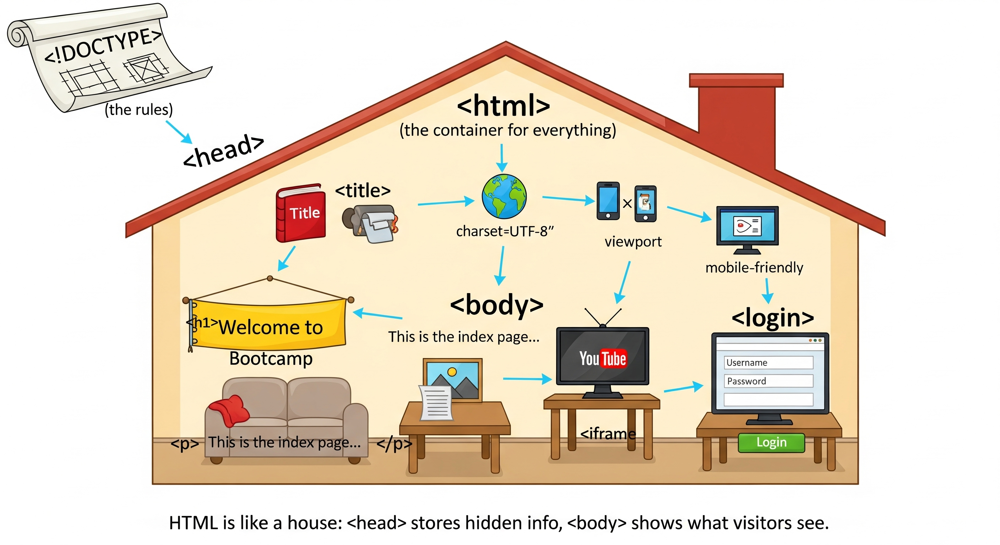

# 📘 Bootcamp Website – README

This file explains what each line of our **Day 3 Bootcamp HTML code** does, using **simple examples** you can relate to.

---
# 👉 Watch the step-by-step video guide here:
 [Bootcamp Live Class – Day 3](https://www.youtube.com/live/sO8GWi6uybQ)

## 🎨 Visual Guide
Here’s a simple diagram that shows how our HTML page works (like a house 🏡):



## 📌 Join our growing tech family on Telegram and never miss out on updates, live coding sessions, and free resources:
👉 [Join our Telegram Community](https://t.me/AscendTribe)

## 🔹 How to Create and Run This File

### On a Laptop/PC

1. Open **Notepad** (Windows) or **TextEdit** or any text editor (VS Code, Sublime, etc.).
2. Copy the code into the editor.
3. Save the file as `index.html`

   * Make sure the extension is `.html`, not `.txt`.
4. Double-click the file. It will **open in your browser** (Chrome, Edge, Safari, etc.). 🎉

### On a Phone (Android)

1. Install a text editor app like **Acode** or **Spck Editor**.
2. Create a new file and name it `index.html`.
3. Paste the code.
4. Open the file in your mobile browser to see the website.

---

## 🔹 Code Explanation (Line by Line)

Here’s the code with **simple real-life explanations**:

👉 [Click here to open index.html](./index.html)  

```html
<!DOCTYPE html>
```

👉 Think of this as the **blueprint approval** for your house (website). It tells the browser: *“This page uses HTML5.”*

```html
<html>
```

👉 The **walls of your house**. Everything inside your website lives here.

```html
<head>
```

👉 The **storeroom or control room**. It keeps important settings visitors don’t see directly.

```html
<meta charset="UTF-8">
```

👉 This is like choosing a **universal language** for your house. It makes sure all characters (letters, emojis, symbols) display correctly worldwide.

```html
<title>Bootcamp Website</title>
```

👉 The **nameplate of your house**. This shows up on the browser tab.

```html
<meta name="viewport" content="width=device-width, initial-scale=1.0">
```

👉 Makes your website **mobile-friendly** 📱. It ensures the house looks good whether viewed on a phone or computer.

```html
</head>
```

👉 End of the control room.

```html
<body>
```

👉 The **living room of your house** – where visitors see and interact with things.

```html
<h1>Welcome to Bootcamp</h1>
```

👉 A **big headline** like a banner on your wall.

```html
outside
```

👉 Just plain text sitting outside of any tag. It still shows up, but it’s like scribbling on the wall without framing it.

```html
<p>This is the index page for your project.</p>
```

👉 A **paragraph of text**, like writing on paper for visitors to read.

```html

```

👉 A **picture frame**. `src="./img.png"` tells the browser where to find the image.
*(If no image is there, the frame shows empty.)*

```html
<h1>Here is our LIVE Class for Day 3</h1>
```

👉 Another **headline banner**.

```html
<iframe ...> ... </iframe>
```

👉 This is like **embedding a TV screen** 📺 inside your wall. It displays a YouTube video directly on your page.

```html
<h1>Login Form</h1>
```

👉 A headline introducing a **form section**.

```html
<form action="/submit" method="post">
```

👉 A **form container** where visitors can fill details.

* `action="/submit"` tells where the info goes when submitted.
* `method="post"` means it will be sent securely.

```html
<label for="username">Username:</label>
<input type="text" id="username" name="username" required>
```

👉 This is a **username box** where someone writes their name.

* The label is like a **signboard**.
* The input is the **empty box**.
* `required` means you **must fill it in**.

```html
<label for="password">Password:</label>
<input type="password" id="password" name="password" required>
```

👉 A **password box**. When you type, it hides the characters with dots (●●●).

```html
<input type="submit" value="Login">
```

👉 The **Login button**. When clicked, it sends the username & password.

```html
</form>
```

👉 End of the form.

```html
</body>
```

👉 End of the living room.

```html
</html>
```

👉 End of the house. Everything is now closed properly.

---

## 🔹 What This Page Does

* Shows a **headline** and **paragraph**
* Displays an **image**
* Embeds a **YouTube live class**
* Provides a **login form** for username & password

---

👉 After saving and opening in a browser, your page will look like a **mini-website** with text, images, video, and a form. 🎉
